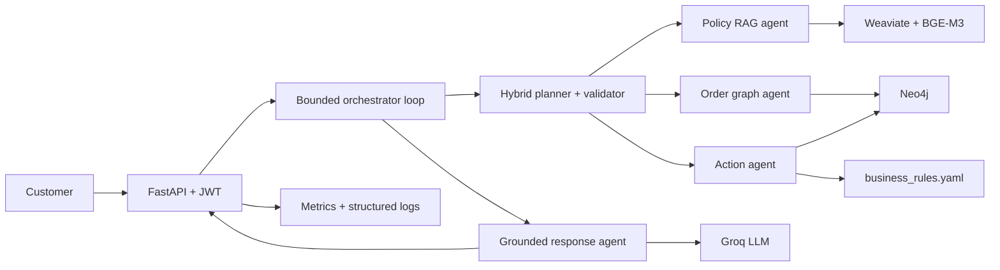
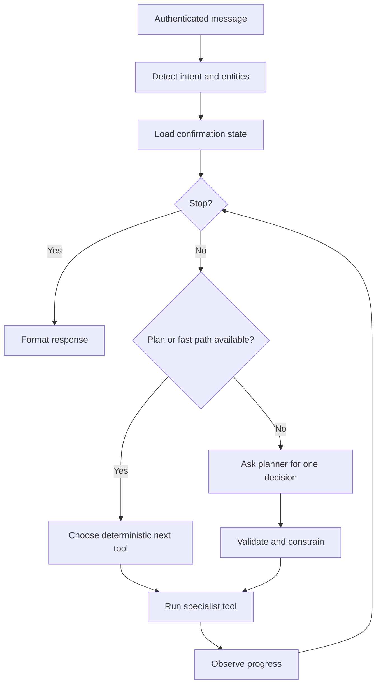

# FusionMind

**Agentic AI customer support for e-commerce operations**

FusionMind is a backend-first support platform combining a bounded agent loop,
hybrid retrieval-augmented generation (RAG), a Neo4j knowledge graph,
deterministic business rules, and confirmed business actions. It answers policy
questions, retrieves customer-owned order facts, evaluates eligibility, requests
confirmation, and completes controlled support workflows.

> **Repository completeness:** the backend, frontend, evaluation, monitoring,
> data, graph, scripts, and tests are present. The current `main` snapshot does
> not include `.env.example`, `business_rules.yaml`, `docker-compose.yml`,
> or `frontend/src/lib/`. Restore these required runtime artifacts before
> attempting a complete stack startup.

## Contents

- [Capabilities](#capabilities)
- [Architecture](#architecture)
- [Agent loop and safety](#agent-loop-and-safety)
- [Technology stack](#technology-stack)
- [Repository structure](#repository-structure)
- [Quick start](#quick-start)
- [Data preparation](#data-preparation)
- [Configuration](#configuration)
- [API](#api)
- [Testing and evaluation](#testing-and-evaluation)
- [Monitoring](#monitoring)
- [Business rules](#business-rules)
- [Security](#security)
- [Troubleshooting](#troubleshooting)
- [Known limitations](#known-limitations)
- [Contributing](#contributing)
- [Team and license](#team-and-license)

## Capabilities

| Customer need | Intent | Tools | Result |
|---|---|---|---|
| Policy question | `policy_question` | Policy RAG | Grounded answer with citations |
| Order location | `order_tracking` | Order graph | Customer-owned order status |
| Refund | `refund_request` | RAG, graph, action | Request or rule-based denial |
| Return | `return_request` | RAG, graph, action | Request or rule-based denial |
| Replacement | `replacement_request` | RAG, graph, action | Request or rule-based denial |
| Damaged product | `damaged_product` | RAG, graph, action | Refund flow with evidence requirement |
| Warranty | `warranty_claim` | RAG, graph, action | Claim or rule-based denial |
| Cancellation | `cancel_order` | Graph, action | Cancellation or denial |
| Payment problem | `payment_issue` | Graph, RAG, action | Support ticket |
| Case status | `ticket_status` | Order graph | Ticket/request status |

## Architecture



Main responsibilities:

- **Orchestrator:** state, tool selection, observations, plan reuse, fallbacks,
  confirmation, progress detection, and stop conditions.
- **RAG agent:** hybrid keyword/semantic policy retrieval.
- **Graph agent:** customer-scoped orders, tickets, requests, and payments.
- **Action agent:** deterministic eligibility and approved graph mutations.
- **Response agent:** templates for deterministic outcomes and grounded LLM
  generation for natural-language answers.

## Agent loop and safety

FusionMind is not a single prompt chain. Each request becomes an
`OrchestratorState`. The controller repeatedly selects one next tool, validates
the decision, executes it, records an observation, checks progress, and either
continues or stops.



Default limits are five iterations, four tool calls, one call per repeated tool,
a planner confidence threshold of 0.75, and a five-second timeout target. When
the planner is disabled, unavailable, invalid, or low-confidence, deterministic
routing continues safely.

Sensitive operations follow this sequence:

```text
verify customer ownership
  -> evaluate eligibility
  -> show proposed action
  -> receive explicit yes/no confirmation
  -> reload the current customer-owned order
  -> re-evaluate eligibility
  -> execute
```

Additional protections:

- Identity comes from the verified JWT, never planner arguments.
- Sensitive requests never silently select the latest order.
- Missing or unverifiable business data fails closed.
- Planner output is schema-validated and deterministically constrained.
- Unknown citations are removed and counted as grounding mismatches.
- Public registration cannot create privileged accounts.
- Tool, iteration, repetition, and no-progress limits prevent runaway loops.

## Technology stack

| Layer | Technology |
|---|---|
| API | Python 3.11, FastAPI, Uvicorn, Pydantic |
| Orchestration | Custom bounded state loop and hybrid planner |
| LLM | Groq; `openai/gpt-oss-120b` by default |
| Planner | Groq; `openai/gpt-oss-20b` by default |
| Embeddings | `BAAI/bge-m3`, Sentence Transformers |
| Retrieval | Weaviate hybrid BM25/vector search |
| Graph | Neo4j 5.14 Community and APOC |
| Auth | JWT and bcrypt |
| Rules | YAML single source of truth |
| Monitoring | Prometheus client metrics and structured logs |
| Tests | Pytest |
| Packaging | Backend and frontend Dockerfiles |

## Repository structure

```text
main-repo/
|-- backend/app/
|   |-- agents/       # orchestrator, RAG, graph, action, response
|   |-- api/          # auth, chat, orders, health
|   |-- auth/         # JWT, passwords, middleware
|   |-- graph/        # Neo4j client and queries
|   |-- monitoring/   # metrics and request middleware
|   `-- rag/          # chunking, embeddings, Weaviate ingestion
|-- data/
|   |-- policies/     # grounded policy sources
|   |-- processed/    # demo CSVs
|   `-- seed/         # tickets, requests, payment issues
|-- neo4j/            # schema, constraints, indexes, migration
|-- frontend/         # Next.js App Router interface
|-- eval/             # held-out fixtures, scoring, and reports
|-- monitoring/       # Prometheus and Grafana configuration
|-- scripts/          # data and ingestion commands
|-- tests/
|-- requirements.txt
`-- TEAM_CONTRACT.md
```

Required runtime artifacts currently missing from `main` are listed in the
completeness note above. In particular, action execution needs
`business_rules.yaml`, and the frontend needs `src/lib/api` and
`src/lib/types` before it can build.

## Quick start

### Prerequisites

Install Git, Python **3.11**, Node.js **20**, npm, PowerShell or Git Bash,
and obtain a Groq API key. Neo4j and Weaviate must also be reachable.

```bash
git --version
python --version
```

### 1. Clone and configure

Accept the private repository invitation first.

```bash
git clone https://github.com/capstone-group1-team3/main-repo.git
cd main-repo
```

Create a local `.env` file manually. The template is not present in the current
`main` snapshot, so use the canonical variable names below:

Set at least:

```env
NEO4J_PASSWORD=replace-with-a-strong-password
GROQ_API_KEY=replace-with-your-key
PLANNER_GROQ_API_KEY=replace-with-a-separate-key-or-leave-empty
JWT_SECRET=replace-with-a-long-random-secret
```

An empty planner key disables the LLM planner and uses deterministic routing.
Never commit or share `.env`.

```bash
git check-ignore .env
git ls-files .env
```

The first command should print `.env`; the second should print nothing.

### 2. Install Python dependencies

PowerShell:

```powershell
python -m venv .venv
.\.venv\Scripts\Activate.ps1
python -m pip install --upgrade pip
pip install -r requirements.txt
```

Git Bash/macOS/Linux:

```bash
python -m venv .venv
source .venv/bin/activate
python -m pip install --upgrade pip
pip install -r requirements.txt
```

BGE-M3 downloads on first use and is cached for later starts.

### 3. Provision data services and ingest data

The repository currently has no Compose manifest. Provision Neo4j and Weaviate
with your approved local or team configuration, then set their connection
values in `.env`. Once both services are reachable, run:

```bash
python scripts/build_neo4j_graph.py --with-schema
python scripts/ingest_rag_documents.py --full
```

The included processed data and seed records are sufficient for a demo. Graph
loading uses `MERGE`, and RAG chunks have deterministic IDs, so these commands
are safe to rerun.

### 4. Run the backend

PowerShell:

```powershell
$env:PYTHONPATH = "backend"
uvicorn app.main:app --host 0.0.0.0 --port 8000 --reload
```

Git Bash/macOS/Linux:

```bash
PYTHONPATH=backend uvicorn app.main:app --host 0.0.0.0 --port 8000 --reload
```

Open:

| Service | URL |
|---|---|
| API | <http://localhost:8000> |
| Swagger | <http://localhost:8000/docs> |
| Health | <http://localhost:8000/health> |
| Readiness | <http://localhost:8000/ready> |
| Metrics | <http://localhost:8000/metrics> |
| Neo4j Browser | <http://localhost:7474> |
| Weaviate | <http://localhost:18080> |

`/health` checks the process. `/ready` checks Neo4j plus Weaviate HTTP and
gRPC, and returns HTTP 503 until they are ready.

### 5. Install and run the frontend

```bash
cd frontend
npm ci
npm run dev
```

`npm run build` currently requires the missing `frontend/src/lib/api` and
`frontend/src/lib/types` modules. Restore those shared modules before
expecting the frontend production build to succeed.

## Data preparation

Included data:

- `data/processed/`: customer, order, item, product, and payment CSVs.
- `data/seed/`: generated tickets, requests, and payment issues.
- `data/policies/`: Markdown sources used by RAG.
- `business_rules.yaml`: expected executable rule source; currently absent from `main`.

The data is derived from Olist and converted into deterministic demo identities;
it is not live customer data.

After restoring `business_rules.yaml`, rebuild processed data from the five
required Olist CSVs:

```bash
python scripts/prepare_full_dataset.py --source path/to/olist --output data/processed
python scripts/generate_support_layer.py --processed data/processed --rules business_rules.yaml --out data/seed --seed 42
python scripts/build_neo4j_graph.py --with-schema
python scripts/ingest_rag_documents.py --full
```

`prepare_full_dataset.py` accepts `--anchor-date YYYY-MM-DD` to shift the
historical timeline while preserving intervals. Graph loading also accepts
`--processed`, `--seed`, `--neo4j-dir`, and `--skip-repair`.

For a valuable existing graph, follow `neo4j/MIGRATION.md`, back up first, run
duplicate checks, and use an audited migration.

Use incremental policy ingestion after ordinary policy edits:

```bash
python scripts/ingest_rag_documents.py
```

## Configuration

See `.env.example` for the canonical variable list.

| Variable | Default | Purpose |
|---|---|---|
| `NEO4J_URI` | `bolt://localhost:7687` | Graph endpoint |
| `WEAVIATE_HOST` | `localhost` | Vector store host |
| `WEAVIATE_HTTP_PORT` | `18080` | HTTP port |
| `WEAVIATE_GRPC_PORT` | `50051` | gRPC port |
| `EMBEDDING_MODEL` | `BAAI/bge-m3` | Embedding model |
| `GROQ_MODEL` | `openai/gpt-oss-120b` | Response model |
| `PLANNER_MODEL` | `openai/gpt-oss-20b` | Planning model |
| `JWT_EXPIRE_MINUTES` | `120` | Token lifetime |
| `MAX_ITERATIONS` | `5` | Loop bound |
| `MAX_TOOL_CALLS` | `4` | Tool bound |
| `RETRIEVAL_TOP_K` | `4` | Retrieved chunks |
| `RETRIEVAL_MIN_SCORE` | `0.15` | Evidence threshold |
| `HYBRID_ALPHA` | `0.5` | Vector/keyword balance |
| `EVALUATION_METADATA_ENABLED` | `false` | Internal chat metadata |

Compose overrides service hostnames inside the backend container. Keep localhost
values when running scripts or Uvicorn on the host.

## API

Interactive documentation: <http://localhost:8000/docs>

| Method | Path | Auth | Purpose |
|---|---|---|---|
| GET | `/` | No | Service information |
| GET | `/health` | No | Liveness |
| GET | `/ready` | No | Dependency readiness |
| GET | `/metrics` | No | Prometheus metrics |
| POST | `/auth/register` | No | Link account to existing customer |
| POST | `/auth/login` | No | Email login |
| POST | `/auth/login/customer` | No | Demo customer-ID login |
| GET | `/auth/me` | Bearer | Current identity |
| POST | `/chat` | Bearer | Run support agent |
| GET | `/orders` | Bearer | Customer orders |
| GET | `/orders/tickets` | Bearer | Customer tickets |
| GET | `/orders/requests` | Bearer | Service requests |
| GET | `/orders/admin/tickets` | Staff | All tickets |

Registration requires an existing `customer_id` and matching customer email.

```bash
curl -X POST http://localhost:8000/auth/register \
  -H "Content-Type: application/json" \
  -d '{"email":"customer@example.com","password":"choose-a-password","customer_id":"CUST00001"}'
```

Demo login:

```bash
curl -X POST http://localhost:8000/auth/login/customer \
  -H "Content-Type: application/json" \
  -d '{"customer_id":"CUST00001","password":"your-demo-password"}'
```

Chat:

```bash
curl -X POST http://localhost:8000/chat \
  -H "Authorization: Bearer <jwt>" \
  -H "Content-Type: application/json" \
  -d '{"message":"What is the refund policy?","history":[]}'
```

For a sensitive request, include its order ID. If eligible, the response returns
a confirmation prompt and `conversation_id`. Confirm in a second request:

```json
{
  "message": "yes",
  "conversation_id": "<id-from-previous-response>",
  "history": []
}
```

Send `no` with the same ID to decline. Confirmation expires after 15 minutes.

Example prompts:

```text
What is the refund policy?
Who pays return shipping for a defective item?
Where is order ORD000145?
I want a refund for damaged order ORD000145.
What is the status of my support request?
```

## Testing and evaluation

From the repository root:

```powershell
$env:PYTHONPATH = "backend"
python -m pytest -q
```

Or:

```bash
PYTHONPATH=backend python -m pytest -q
```

The suite covers intent detection, planner schemas, business-rule boundaries,
confirmation, graph mutations, auth protections, embeddings, health,
monitoring, grounding, and scoring.

Focused checks:

```bash
python -m compileall -q backend
python -m pytest -q tests/test_planner_schema.py
python -m pytest -q tests/test_confirmation.py
python -m pytest -q tests/test_security_foundation.py
python -m pytest -q tests/test_business_rules.py
```

The `eval/` package is included. With the API running and an evaluation token
available, run the read-only graph evaluation with:

```bash
python -m eval.run_eval --graph-read-only
```

Results are written to `eval/reports/results.json` and
`eval/reports/report.md` by default.

The evaluation runner measures intent accuracy, entity match, retrieval
top-k and MRR, tool-path accuracy, citation validity, grounding, business-rule
correctness, action safety, and latency. Set
`EVALUATION_METADATA_ENABLED=true` only for controlled evaluation; keep it
false for customer traffic.

## Monitoring

The backend exposes liveness, readiness, Prometheus metrics, structured logs,
and `X-Request-ID`. It records:

- HTTP volume, status, duration, and in-flight requests.
- Intent/entity latency and fallback failures.
- Planner confidence, latency, failures, and timeouts.
- Fast-path, fallback, loop, tool, and completion metrics.
- Neo4j and RAG duration/failures.
- Confirmation, safety, eligibility, and action outcomes.
- Grounded responses and invalid citation attempts.

Prometheus configuration and a provisioned Grafana dashboard are included under
`monitoring/`. Connect them through the team deployment configuration, then use
Prometheus on port `9090` and Grafana on port `3001`. Change default credentials
and restrict both services outside local development.

## Business rules

The backend expects `business_rules.yaml` as the executable source of truth,
but that file is missing from the current `main` snapshot. Restore the approved
rule file before running action workflows. Markdown under `data/policies/` is
the customer-facing source used by RAG.

When a rule changes:

1. Update `business_rules.yaml`.
2. Update the matching policy Markdown.
3. Add or update boundary tests.
4. Run business-rule tests.
5. Re-ingest policy documents.
6. Review confirmation and denial messages.

Never hard-code a second copy of a rule number in an action handler.

## Security

- Never commit `.env`, keys, passwords, JWTs, models, databases, or volumes.
- Replace every development secret before deployment.
- Share secrets only through an approved private secret manager.
- Rotate exposed secrets immediately; deleting a commit is not sufficient.
- Keep evaluation metadata disabled for customer traffic.
- Restrict `/metrics`, `/docs`, Neo4j Browser, and Weaviate by network policy.
- Use HTTPS, short-lived tokens, and audited graph migrations.
- Never bypass ownership, eligibility, or confirmation gates.

Registration currently matches an email to an existing customer record. This is
appropriate for a controlled demo, not a replacement for production email
verification, MFA, recovery, rate limiting, or enterprise identity.

## Troubleshooting

### Readiness returns 503

```bash
curl http://localhost:8000/ready
```

Inspect the Neo4j and Weaviate processes through the tool used to provision
them. Host-run Python uses Neo4j port 7687, Weaviate HTTP 18080, and gRPC 50051.

### Neo4j authentication fails

`NEO4J_PASSWORD` must match the password used when the Neo4j volume was first
created. Editing `.env` does not change an existing volume's credentials.

### Policy answers always decline

Confirm Weaviate is ready, verify its host/ports, and run:

```bash
python scripts/ingest_rag_documents.py --full
```

### Backend startup is slow

The first start downloads and initializes BGE-M3. CPU initialization can take
time; later Docker starts reuse the named Hugging Face cache.

### Planner is never used

Set `PLANNER_GROQ_API_KEY`. If it is empty, deterministic routing is expected.

### Full-stack startup files are missing

The current `main` snapshot has no `.env.example`, `business_rules.yaml`, or
`docker-compose.yml`. Restore the approved versions before following the team
full-stack deployment workflow.

### Frontend build cannot resolve shared modules

Restore `frontend/src/lib/api` and `frontend/src/lib/types`. Existing pages and
components import these modules, so `npm run build` cannot succeed without them.

## Known limitations

- Confirmation state is in process memory; production needs an atomic,
  durable store such as Redis.
- Mutations affect the demo Neo4j graph, not a live commerce, payment, shipping,
  CRM, or help-desk platform.
- Production mutation idempotency and concurrency controls need hardening.
- Multi-goal state exists, but independent goal advancement is limited.
- Intent/entity extraction targets supported English support cases.
- Required runtime configuration files and frontend shared modules are missing
  from the current `main` snapshot.
- Rate limiting, email verification, MFA, recovery, durable audits, and formal
  retention controls are not included.

## Contributing

Use one focused branch per task:

```text
feature/<short-task-name>
fix/<bug-name>
docs/<document-name>
eval/<evaluation-task>
<github-handle>/<short-task-name>
```

Pull-request title:

```text
<type>/<slug>: <short imperative summary>
```

Include **What changed**, **Why**, **Test evidence**, and **Notes for reviewers**.
The team contract requires two approvals before merging to `main`. Keep PRs
small, link the project-board card, update docs, and request review again after
material changes.

Before review:

```bash
git status
python -m compileall -q backend
python -m pytest -q
```

Do not commit directly to `main`, bypass protection, or rewrite a teammate's
work without discussion.

## Team and license

Primary ownership is summarized below; architecture reviews, integration, testing, debugging, documentation, and demo preparation were shared by the whole team:

- Marwan Al-Masrat: Team Leader; led the project foundation, system architecture, task coordination, and Agentic AI orchestrator, and co-designed Neo4j and graph-agent integration with Jineen.
- Jineen Al-Hourani: led data preparation, Neo4j and RAG ingestion, collaborated with Marwan on graph integration, and co-developed the NLP processing layer with Mohammed and Rand.
- Mohammed Al-Shaikhe: led FastAPI, JWT security, customer-scoped APIs, and health checks, collaborated with Marwan and Rand on system integration, and co-developed the NLP processing layer with Jineen and Rand.
- Rand Abu Awwad: led evaluation, monitoring, observability, and frontend improvements, collaborated with Mohammed on frontend/API integration, and co-developed the NLP processing layer with Jineen and Mohammed.

See `TEAM_CONTRACT.md` for the collaboration and review agreement.

Licensed under the MIT License. See `LICENSE`.
